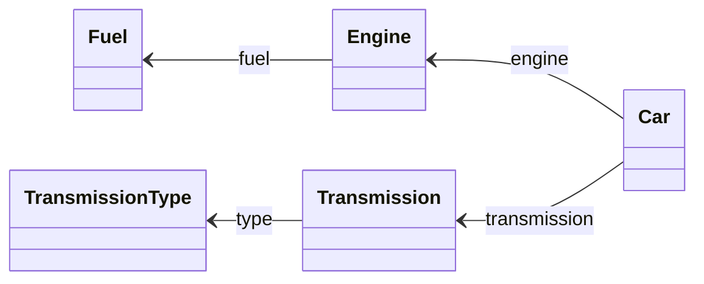

# PHASE 1
## Performance Testing and Implementation – Reflective Repository

### Domain Model

The model used in the tests represents a scenario with nested entities and composition/association relationships, similar to an automotive system. The following diagram illustrates the domain structure:



* Car is the main entity, containing references to Engine and Transmission.

* Engine has an enumerated Fuel entity.

* Transmission has an enumerated TransmissionType entity.

The model was designed to test the ability to resolve associations, hydrate object graphs, and handle enums.

### Implementation: RepositoryReflect

The RepositoryReflect class is a generic reflection-based implementation that:

* Dynamically determines the table name from the class (`KClass<T>`).

* Uses introspection to detect the property annotated with `@Pk` (primary key).

* Extracts column names through `@Column` annotations, or falls back to parameter names if not present.

* Automatically maps the ResultSet to domain instances via the primary constructor.

* Supports enums and associations to other entities annotated with `@Table`, resolving them via subqueries.

* Uses column name caching to reduce overhead.

This design offers great flexibility and avoids the need for manual definitions, making it ideal for generic scenarios.

### Performance Tests
Benchmarks were performed comparing the reflective repository with a baseline version based on direct JDBC access:

```
RepositoryBench.benchRepositoryJdbcGetAllChannels     avgt    4    720,845 ±    24,855  ns/op
RepositoryBench.benchRepositoryReflectGetAllChannels  avgt    4  77792,876 ± 11234,762  ns/op
```

#### Observations
* The reflective version is approximately 96x slower than direct JDBC access.

* The use of introspection (`KClass`, `KParameter`, `memberProperties`, `annotations`) and runtime association resolution contributes significantly to the overhead.

* Each `getAll()` call results in a series of nested method calls due to reflection on composed types.

### Improvements Implemented
* Column name caching to avoid repeated introspection operations during execution.

* Support for enums and associated entities through reflection, allowing automatic reconstruction of values based on the domain model definition.

* Fallback mechanisms for column names in the absence of explicit annotations.


### Issues Found
* Significantly lower performance due to intensive use of reflection and subqueries for resolving associations.

* Synchronous subquery-based associations: each related entity is loaded individually with a new query, which affects scalability.

* Lack of batching or true lazy loading — all associations are loaded eagerly.

# PHASE 2
### Performance Tests
Benchmarks were performed comparing the reflective repository and dynamic repository with a baseline version based on direct JDBC access:

```
CarRepositoryBench.benchRepositoryDynamicGetAllChannels  avgt    4  233949,309 ± 100338,693  ns/op
CarRepositoryBench.benchRepositoryJdbcGetAllChannels     avgt    4   13649,696 ±  27434,481  ns/op
CarRepositoryBench.benchRepositoryReflectGetAllChannels  avgt    4  231257,551 ±  46232,306  ns/op
RepositoryBench.benchRepositoryDynamicGetAllChannels     avgt    4  108230,057 ±  23968,493  ns/op
RepositoryBench.benchRepositoryJdbcGetAllChannels        avgt    4    1371,949 ±   1400,257  ns/op
RepositoryBench.benchRepositoryReflectGetAllChannels     avgt    4  107707,451 ±  13222,691  ns/op
```
